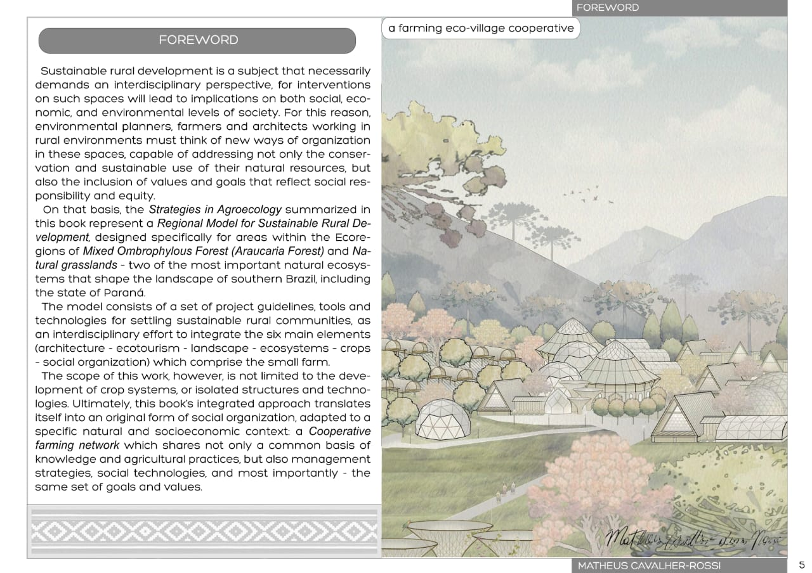

# Strategies in Agroecology
Strategies in Agroecology describes a sustainable rural development model for the Araucaria Forest and Natural Grasslands Ecoregions of southern Brazil, outlining a series of context-adapted ecological agroecosystems and social technologies supported by a farming cooperative network.
Ultimately aimed at professionals looking for innovative sustainable and socially just alternatives to the mainstream model of agriculture, this richly illustrated guide offers creative insights of how thriving ecological rural communities can be designed through the use of interdisciplinary tools integrating regenerative crop systems, landscape design, architecture, social organization, and environmental conservation as part of the same dynamic equation.

***

  

  

  

  

  

  

  

  

  

  

> This is a preview of Matheus Cavalher-Rossi recently published work, for more information he can be reached at <a href="mailto:matt.cavalherrossi@gmail.com">matt.cavalherrossi@gmail.com</a>